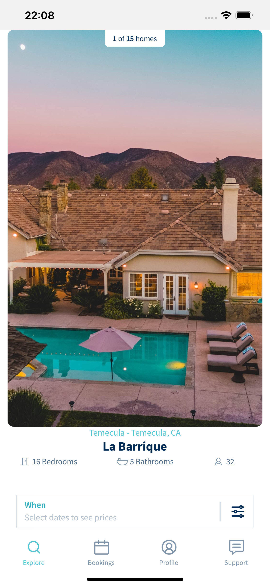

# Avant Stay - Mobile App
  I've created a simplified version of
   search and home details screens for the mobile app of [Avant Stay](https://avantstay.com/)


## Table of contents

  - [Table of contents](#table-of-contents)
  - [General info](#general-info)
  - [Main Technologies Used](#main-technologies-used)
  - [Features](#features)
  - [Screenshots](#screenshots)
  - [Setup](#setup)
  - [Project Status](#project-status)

## General info
This project is a simple version of the Avant Stay Mobile app which I have created using React Native + Typescript. It is consuming a Graphql fake API provided by Avant Stay to test it. I also used Mobx to state management. To test it I used Jest + Testing Library React Native.
	
## Main Technologies Used
- Expo - version 44.0.0
- React - version 17.1.0
- React Native - version 0.64.3
- React Navigation - version 6
- Mobx- version 6.5.0
- Apollo Client(Graphql) - version 3.5.10
- Date-fns - version 2.28.0
- Jest - version 27.5.1
- React Native Testing Library - version 9.1.0

## Features

- Search screen
- Regions filter screen
- Properties details screen
- Single property details screen

## Screenshots


<p float="left">


</p>

<p float="left">
  


</p>

[To see a full implementation video recording using a simulator](./assets/screenshots/videos/avantstay-recording.mp4)


	
## Setup

##### To run this project:
Assuming that you have [Node 12 LTS](https://nodejs.org/en/download/) or greater installed, you can use npm to install the Expo CLI command line utility:

```bash
$ yarn global add expo-cli
```
Then run the following commands to start a development server for you.

```bash
$ yarn 
$ yarn start
```

#### Running your React Native application
Install the Expo client app on your iOS or Android phone and connect to the same wireless network as your computer. On Android, use the Expo app to scan the QR code from your terminal to open your project. On iOS, use the built-in QR code scanner of the Camera app.

## Project Status
Project is:  _no longer being worked on_. This project was a tech challenge that I did to Avant Stay for a React Native position.